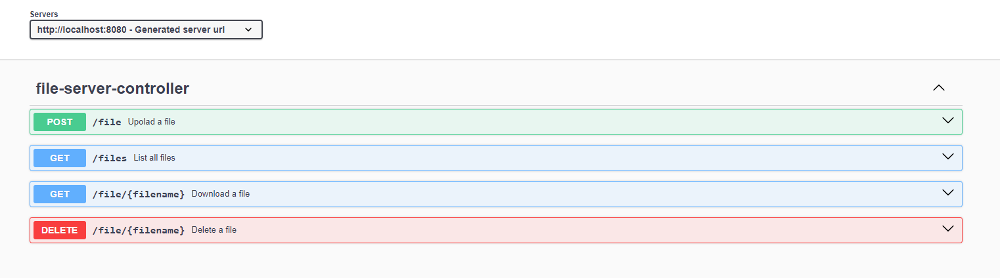

# Simple file server

This application provides a set of APIs for uploading,downloading,listing files uploaded on a local file system. It follows a layered model.

## Assumptions

- File names should only contain alphabets, numbers, hyphen (-), underscore (_) and dot (.).
- Files with duplicate names cannot be uploaded again; the system prevents the upload of files if an existing file with the same name is detected 
- The application operates on a local file system.

## API Endpoints

### Upload a File

- **URL:** `/file`
- **Method:** `POST`
- **Description:** This endpoint allows you to upload a multipart file.

### Download a File

- **URL:** `/file/{filename}`
- **Method:** `GET`
- **Description:** This endpoint allows you to download a file. The `filename` parameter should be the name of the file to download.

### List All Files

- **URL:** `/files`
- **Method:** `GET`
- **Description:** This endpoint returns a list of all uploaded file names.

### Delete a File

- **URL:** `/file/{filename}`
- **Method:** `DELETE`
- **Description:** This endpoint allows you to delete a file. The `filename` parameter should be the name of the file to delete.

## Testing

The testing of this application follows the pyramid model:

- **Unit Tests:** These are the most numerous tests, focusing on individual components in isolation.
- **Integration Tests:** These tests focus on the interaction between components.
- **End-to-End Tests:** These are the least numerous tests, focusing on the application as a whole.

## Getting Started

To get started with this application, you'll need to clone the repository and install the necessary dependencies. Then, you can start the application and begin making requests to the API endpoints.

Please refer to the API documentation for more detailed information about the request and response formats for each endpoint.

